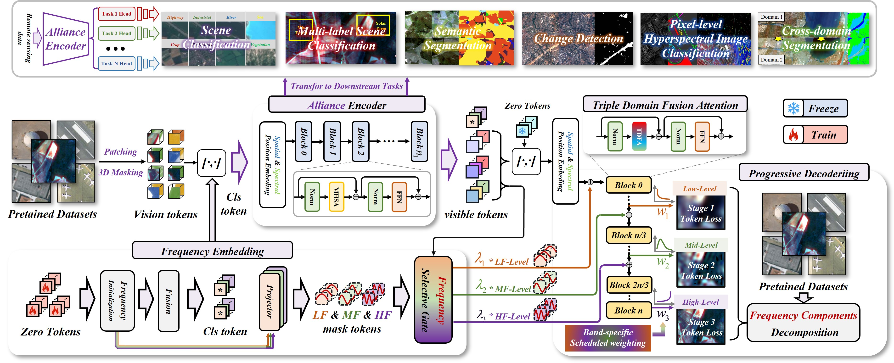

# Alliance: All-in-One Spectral-Spatial-Frequency Awareness Foundation Model

> **Alliance: All-in-One Spectral-Spatial-Frequency Awareness Foundation Model**  
> *Boyu Zhao, Wei Li, Junjie Wang, Yuxiang Zhang, Hong Yang, Haitao Zhao, Ran Tao, Qian Du*  
> IEEE Transactions on Pattern Analysis and Machine Intelligence (TPAMI), 2025

---

## 🧠 Framework Overview

  

---

## 🧩 Abstract

**Frequency-domain analysis** reveals intrinsic image patterns that are difficult to observe from raw pixels, while effectively reducing redundant spatial and spectral information. Although recent **Remote Sensing Foundation Models (RSFMs)** have advanced spatial–spectral feature learning, they often fail to fully exploit **frequency characteristics** that encode hidden structural information. Moreover, existing frequency-aware models tend to lose semantic alignment with the original image content, causing performance degradation in downstream tasks.

To overcome these issues, we propose **Alliance**, an *All-in-One Spectral–Spatial–Frequency Awareness Foundation Model* that achieves unified feature representation across all three domains. Alliance introduces three key innovations:

1. **Progressive Frequency Decoding Mechanism** — Inspired by human visual cognition, it reconstructs features progressively from low to mid to high frequencies, bridging spatial–frequency information gaps while retaining image-level semantics.  
2. **Triple-Domain Fusion Attention Module** — Separately processes **amplitude**, **phase**, and **spectral–spatial relationships**, enabling comprehensive multi-domain feature interaction.  
3. **Frequency-Aware Embedding** — Incorporates frequency-aware *Cls token* and *mask token* initialization for fine-grained modeling of diverse frequency bands.

Additionally, we introduce the **Yellow River Dataset**, a large-scale multi-temporal remote sensing benchmark designed for cross-domain evaluation and foundation model generalizability assessment. Extensive experiments across six downstream tasks validate that Alliance achieves **state-of-the-art performance** and demonstrates strong cross-domain transferability.

